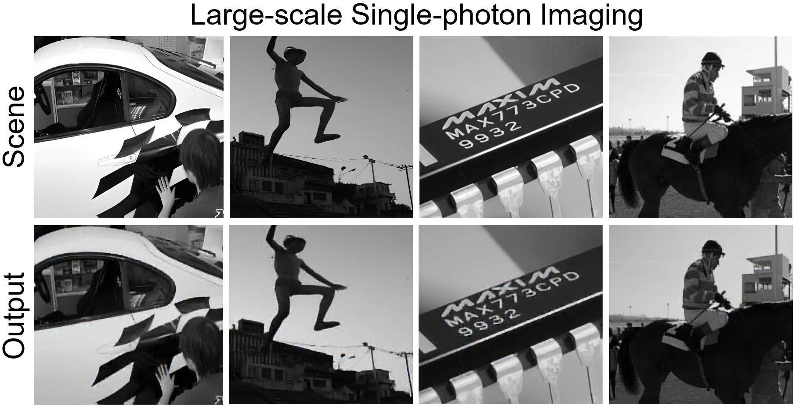
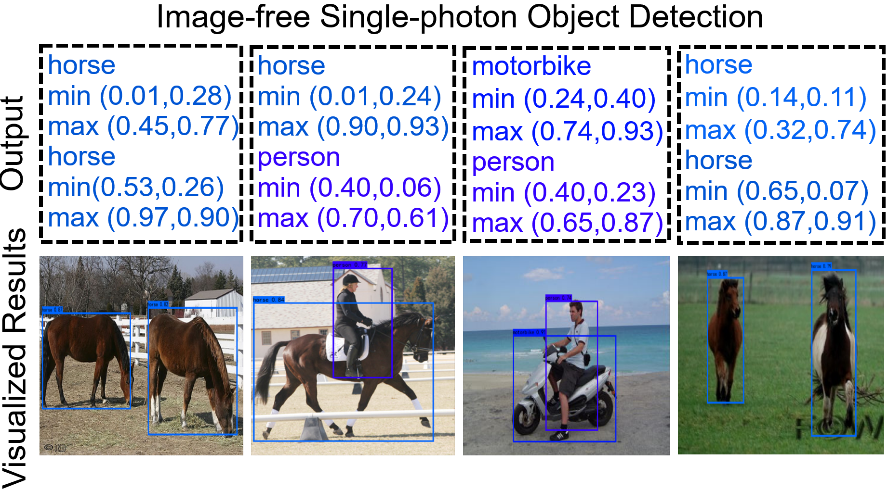

# Physical Super-resolution Single-photon Imaging and Multimodal Sensing


## 1. 💻 System requirements
### 1.1 All software dependencies and operating systems
The project has been tested on Windows 10 and Ubuntu 20.04.6 LTS.
### 1.2 Versions the software has been tested on
The project has been tested on Python 3.9 and pytorch 1.11.
### 1.3 Any required non standard hardware
There is no non-standard hardware required for this project. 


## 2. 🛠️ Installation guide
### 2.1 Instructions

**Create conda pytorch environment**
```
conda create -n Co-SPAD python=3.9
conda activate Co-SPAD
conda install pytorch=1.11 torchvision cudatoolkit=11.3 -c pytorch
```

**Clone the Co-SPAD repository**
```
git clone https://github.com//Co-SPAD.git
cd Co-SPAD
```

**Install dependencies**
```
pip install -r requirements.txt
```
    
### 2.2 Typical install time on a "normal" desk top computer 
The installation time is approximately 5 minute and fluctuates depending on network conditions.

## 3. 🎥 Demo
### 3.1 Instructions to run on data
#### 3.1.1 How to run the large-scale single-photon imaging demo
We have provided the measurements for testing in the  `./Large-scale-single-photon-imaging/features` folder. You can directly run the following command in the terminal to reconstruct the image:
```
cd ./Large-scale-single-photon-imaging
```
Then, run the following command:

```
python imaging.py
```
Co-SPAD reconstruction results will be saved in the `./Large-scale-single-photon-imaging/results` folder


#### 3.1.2 How to run the image-free single-photon object detection demo
We have provided the measurements for testing in the  `./image-free-object-detection/features` folder. You can directly run the following command in the terminal to detect the objects in the scene:
```
cd ./image-free-object-detection
```
Then, run the following command:

```
python detection.py
```
The detection results will be output directly to the terminal and the visualized detection results will show on the screen.


### 3.2 Expected output

#### 3.2.1 Expected output of large-scale single-photon imaging
Co-SPAD reconstruction results will be saved in the `./Large-scale-single-photon-imaging/results` folder.




#### 3.2.2 Expected output of image-free single-photon object detection
The detection results will be output directly to the terminal and the visualized detection results will show on the screen.




### 3.3 Expected run time for demo on a "normal" desktop computer
The estimated time it takes to synthesize an image is typically around 0.5 seconds and can vary depending on the device. The estimated time it takes to enhance an image is typically around 0.2 second and can also vary depending on the device.

## 4. Instructions for use
### 4.1 How to run the large-scale single-photon imaging on your data
We have provided the optimized small-size patterns in the  `./Large-scale-single-photon-imaging/pattern` folder. If you want to run single-photon imaging on your data, you should first put your data in the `test` folder and run `simulate.py` to generate the measurements of your data. The program will read images from the test folder, then use the network-optimized small-size pattern to sample the images and generate 2D measurements, and save them in the `./Large-scale-single-photon-imaging/features` folder.

First, generate measurements:
```
python simulate.py
```
Then, reconstruct the scene:
```
python imaging.py
```


### 4.2 How to run the image-free single-photon object detection on your data
We have provided the optimized small-size patterns in the  `./image-free-object-detection/pattern_005.mat` file. If you want to run image-free single-photon object detection on your data, you should first put your data in the `test` folder and run `simulate.py` to generate the measurements of your data. The program will read images from the test folder, then use the network-optimized small-size pattern to sample the images and generate 2D measurements, and save them in the `./image-free-object-detection/features` folder.

First, generate measurements:
```
python simulate.py
```
Then, run the image-free single-photon object detection:
```
python detection.py
```
